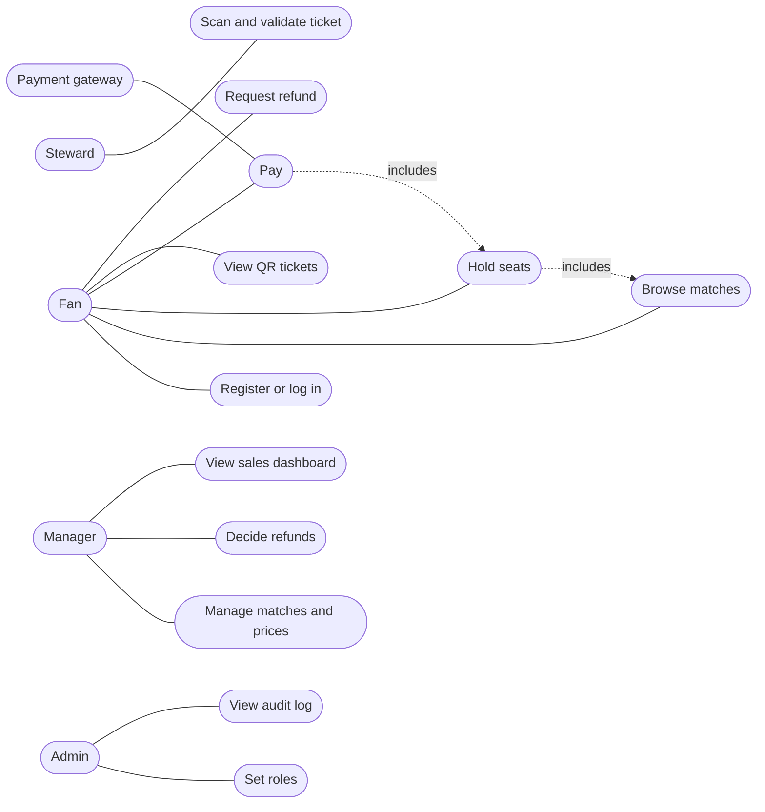
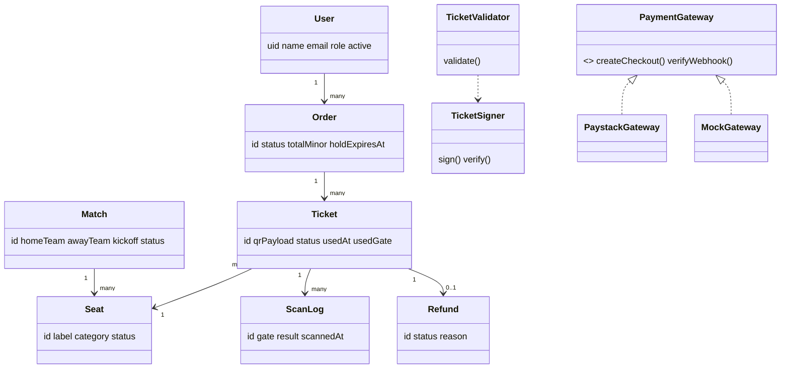
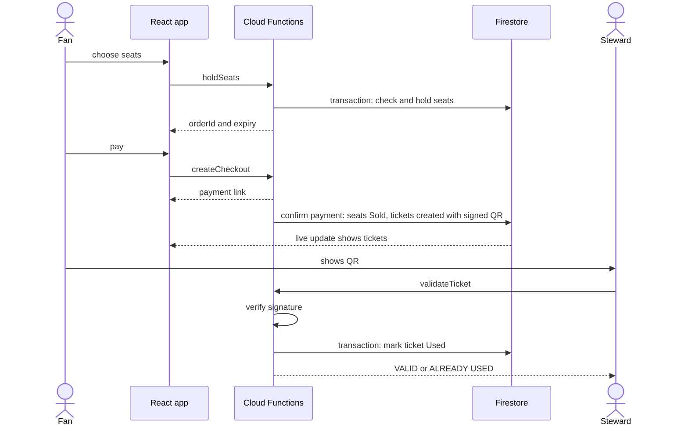
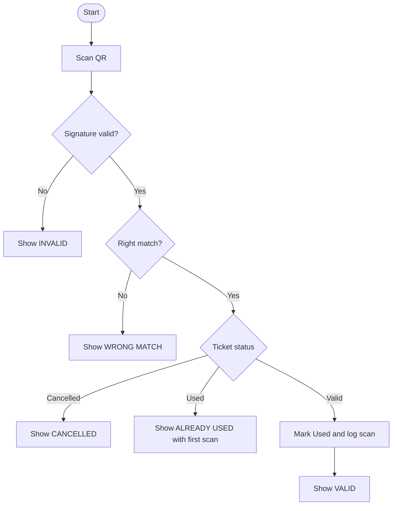
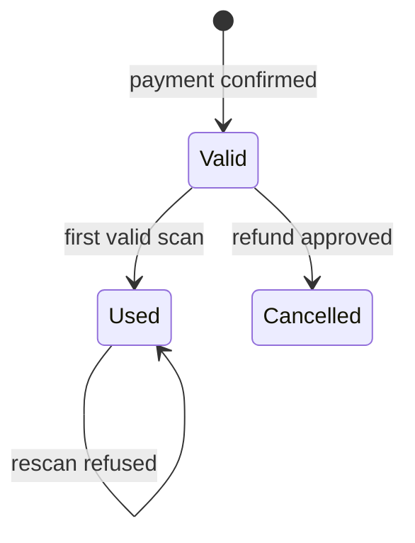

# UML model set

## 1. Use case diagram

```mermaid
flowchart LR
    Fan([Fan]) --- UC1([Register or log in])
    Fan --- UC2([Browse matches])
    Fan --- UC3([Hold seats])
    Fan --- UC4([Pay])
    Fan --- UC5([View QR tickets])
    Fan --- UC6([Request refund])
    Steward([Steward]) --- UC7([Scan and validate ticket])
    Manager([Manager]) --- UC8([Manage matches and prices])
    Manager --- UC9([Decide refunds])
    Manager --- UC10([View sales dashboard])
    Admin([Admin]) --- UC11([Set roles])
    Admin --- UC12([View audit log])
    UC3 -. includes .-> UC2
    UC4 -. includes .-> UC3
    Gateway([Payment gateway]) --- UC4
```

## 2. Class diagram

```mermaid
classDiagram
    class User { uid name email role active }
    class Match { id homeTeam awayTeam kickoff status }
    class Seat { id label category status }
    class Order { id status totalMinor holdExpiresAt }
    class Ticket { id qrPayload status usedAt usedGate }
    class Refund { id status reason }
    class ScanLog { id gate result scannedAt }
    class TicketSigner { sign() verify() }
    class TicketValidator { validate() }
    class PaymentGateway { <<interface>> createCheckout() verifyWebhook() }
    class PaystackGateway
    class MockGateway
    User "1" --> "many" Order
    Order "1" --> "many" Ticket
    Match "1" --> "many" Seat
    Ticket "many" --> "1" Seat
    Ticket "1" --> "many" ScanLog
    Ticket "1" --> "0..1" Refund
    TicketValidator ..> TicketSigner
    PaymentGateway <|.. PaystackGateway
    PaymentGateway <|.. MockGateway
```

## 3. Sequence diagram: buy and enter

```mermaid
sequenceDiagram
    actor Fan
    participant UI as React app
    participant CF as Cloud Functions
    participant DB as Firestore
    actor Steward
    Fan->>UI: choose seats
    UI->>CF: holdSeats
    CF->>DB: transaction: check and hold seats
    CF-->>UI: orderId and expiry
    Fan->>UI: pay
    UI->>CF: createCheckout
    CF-->>UI: payment link
    CF->>DB: confirm payment: seats Sold, tickets created with signed QR
    DB-->>UI: live update shows tickets
    Fan->>Steward: shows QR
    Steward->>CF: validateTicket
    CF->>CF: verify signature
    CF->>DB: transaction: mark ticket Used
    CF-->>Steward: VALID or ALREADY USED
```

## 4. Activity diagram: gate validation

```mermaid
flowchart TD
    A([Start]) --> B[Scan QR]
    B --> C{Signature valid?}
    C -- No --> X[Show INVALID]
    C -- Yes --> D{Right match?}
    D -- No --> Y[Show WRONG MATCH]
    D -- Yes --> E{Ticket status}
    E -- Cancelled --> Z[Show CANCELLED]
    E -- Used --> U[Show ALREADY USED with first scan]
    E -- Valid --> V[Mark Used and log scan]
    V --> G[Show VALID]
```

## 5. Ticket state diagram

```mermaid
stateDiagram-v2
    [*] --> Valid: payment confirmed
    Valid --> Used: first valid scan
    Valid --> Cancelled: refund approved
    Used --> Used: rescan refused
```
